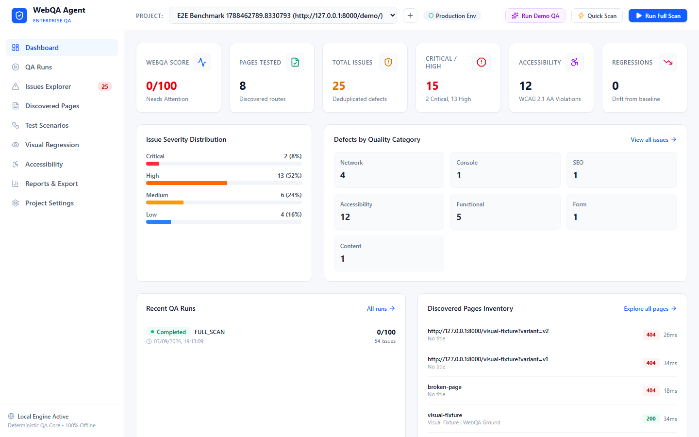
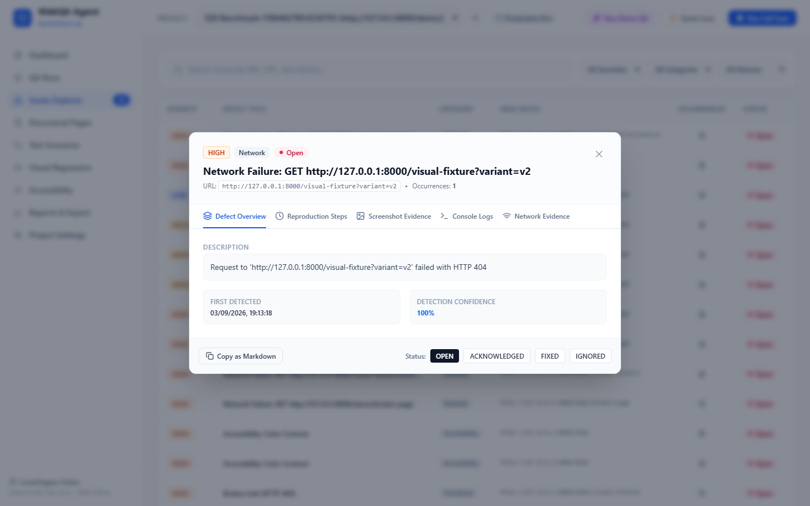
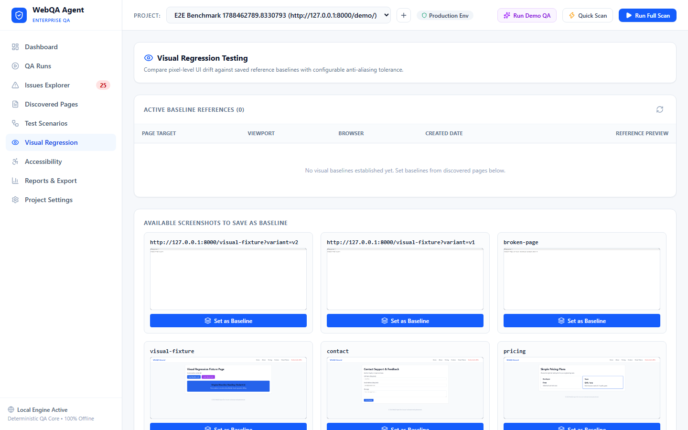
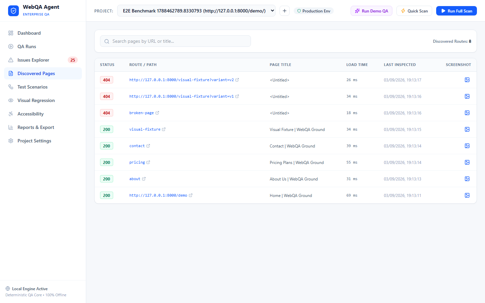
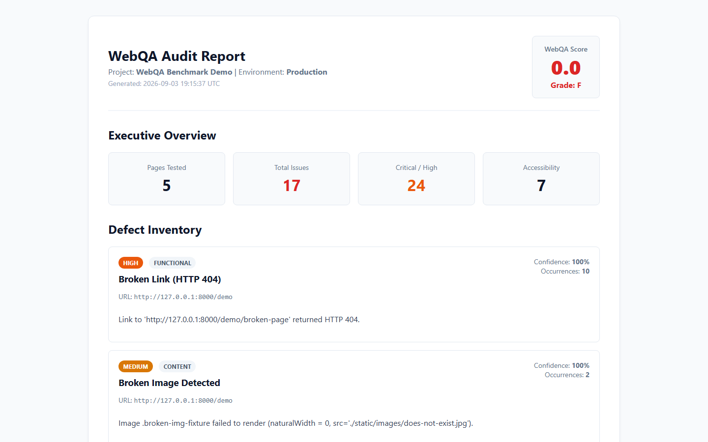

# WebQA Agent

> **Portfolio-Grade Autonomous Website Quality-Assurance & Regression Testing Platform**

[](https://www.python.org/)
[](https://fastapi.tiangolo.com/)
[](https://playwright.dev/)
[](https://react.dev/)
[](https://tailwindcss.com/)
[](https://www.deque.com/axe/)
[](LICENSE)

---

## Overview

**WebQA Agent** is an automated website quality-assurance platform engineered to inspect websites, crawl single-page (SPA) and multi-page (MPA) applications, execute browser workflows, uncover functional, visual, network, console, responsive, and accessibility defects, collect multimodal evidence, calculate transparent quality scores, and enforce repeatable regression testing in CI/CD pipelines.

Unlike superficial website checkers or chatbots, WebQA Agent resembles an internal QA platform used by software engineering teams. Its deterministic testing engine functions **100% offline without external AI availability**, while offering an optional **Google Gemini AI Advisor** for root-cause analysis and engineer remediation guidance.

---

## Product Screenshots

### 1. Executive QA Dashboard
Real-time KPI metrics, 100-point WebQA Project Score, severity breakdown, quality defect category distribution, recent runs, and discovered page telemetry.


### 2. Deep Defect Explorer & Multimodal Evidence
Detailed inspection drawer featuring reproduction steps, red-highlighted element screenshots, network payloads, console stack traces, and one-click Jira/GitHub Markdown export.


### 3. Visual Regression Engine
Pixel-level UI drift detection with anti-aliasing tolerance, side-by-side comparisons, difference overlays, and DOM structural drift analysis.


### 4. Discovered Pages Inventory
Full route discovery with status codes, page load times (ms), accessibility audit badges, and visual thumbnail previews.


### 5. Printable Executive Audit Report
Self-contained, printer-ready HTML executive reports with grade badges, KPI summaries, and actionable quality remediation plans.


---

## Core Capabilities

### 1. Deterministic Core Engine (100% Offline)
- **Zero Cloud or LLM Dependency**: All crawling, link verification, console interception, DOM layout calculations, form audits, and axe-core accessibility checks run deterministically on the local machine.
- **Fast Execution**: Multithreaded and asynchronous Python/Playwright execution pipeline with automatic context isolation.

### 2. Safe Form & Exploratory Interaction Engine
- **Guardrail Action Safety Classifier**: Prior to executing any automated click or submission, the agent inspects button labels, roles, and action URLs. Destructive actions (`Delete`, `Pay Now`, `Purchase`, `Cancel Subscription`, `Drop`, `Transfer`, `Deploy`) are classified as `BLOCKED` by default to prevent accidental data loss or financial charges.
- **Safe Value Generation**: Forms are tested using synthetic, non-destructive test values (`QA Test User`, `qa.test@example.com`, `03001234567`).
- **Validation Defect Detection**: Uncovers missing required field validation, invalid email acceptance, boundary violations, and dead buttons (`BTN_NO_RESPONSE`).

### 3. WCAG 2.1 AA Accessibility Testing
- **Local axe-core Bundle**: Ships with an offline, self-contained `axe.min.js` (no remote CDN requests).
- **Comprehensive Audits**: Inspects color contrast ratios, missing `alt` attributes, empty buttons lacking accessible text or `aria-label`, duplicate IDs, and keyboard navigation focus traps.

### 4. Responsive Layout & Horizontal Overflow Inspection
- **Multi-device Testing**: Validates layouts across 7 viewport configurations (`1920x1080`, `1440x900`, `1366x768`, `1024x768`, `768x1024`, `390x844`, `375x812`).
- **Defect Detection**: Mathematically pinpoints horizontal page overflow (`scrollWidth > innerWidth`), overlapping interactive elements, and viewport boundary clipping.

### 5. Network & Console Diagnostics
- Intercepts uncaught JavaScript exceptions (`TypeError`, hydration mismatches, CSP violations, unhandled Promise rejections).
- Records all network traffic with status codes, payload sizes, and response latencies.
- Groups repeated failures and automatically redacts sensitive headers and query tokens (`Authorization`, `Cookie`, `password`, `token`, `api_key`).

### 6. Transparent WebQA Project Score Formula
Calculates a clear 100-point project score with predictable deductions:
$$\text{Score} = \max\left(0, 100 - (25 \times \text{Critical} + 10 \times \text{High} + 4 \times \text{Medium} + 1 \times \text{Low})\right)$$

### 7. CI/CD Quality Gates & CLI
Enforce quality criteria in automated CI/CD pipelines with deterministic exit codes:
- `0`: Quality gates passed
- `1`: Quality threshold breached (e.g. Critical defects > 0, Score < 80)
- `2`: Execution or connection error

---

## Benchmark Ground Truth Validation

WebQA Agent includes a bundled benchmark reference website (`demo_site/server.py`) containing intentional defects across every QA category. The automated validation suite (`tests/test_benchmark_e2e.py`) tests the platform against `demo_site/benchmark.json`:

| Defect Category | Target Route | Intentional Defect | Detection Rule | Status | Confidence |
| :--- | :--- | :--- | :--- | :---: | :---: |
| **Navigation** | `/demo/about` | Broken HTTP 404 Anchor Link | `LINK_HTTP_404` | **PASSED** | 100% |
| **Asset** | `/demo` | Broken Image Source (`does-not-exist.jpg`) | `IMG_BROKEN_SRC` | **PASSED** | 100% |
| **Accessibility** | `/demo` | Missing Image `alt` Attribute | `image-alt` | **PASSED** | 100% |
| **Accessibility** | `/demo` | Empty Interactive Button | `button-name` | **PASSED** | 100% |
| **Console** | `/demo` | Uncaught TypeError Exception | `CONSOLE_UNCAUGHT_ERR`| **PASSED** | 95% |
| **Network** | `/demo` | Internal Server Error 500 Endpoint | `NET_STATUS_500` | **PASSED** | 100% |
| **Responsive** | `/demo` | 900px Container Overflow on Mobile | `LAYOUT_HORIZ_OVERFLOW`| **PASSED** | 100% |
| **Form** | `/demo/contact` | Accepts Empty Required Submission | `FORM_REQ_EMPTY_SUBMIT`| **PASSED** | 92% |
| **Safety Guard** | `/demo` | Destructive Delete / Pay Buttons | Guardrail Classifier | **BLOCKED** | 100% |

---

## System Architecture

```mermaid
flowchart TD
    subgraph Frontend ["Modern React + TypeScript UI"]
        UI[App Shell & Navigation]
        Dash[Executive Dashboard]
        Live[Real-time Telemetry & Events]
        Issues[Defect Explorer & Evidence Drawer]
        Visual[Pixel Diff & Baseline Studio]
        Scenarios[Visual Scenario Builder]
    end

    subgraph Backend ["FastAPI Backend Engine"]
        API[FastAPI Routers]
        Orch[QA Orchestrator]
        Crawler[SPA / MPA Page Crawler]
        Diag[Console & Network Diagnostics]
        A11y[Offline Axe-Core Engine]
        Resp[Responsive Layout Tester]
        Forms[Safe Form Tester]
        Safety[Guardrail Action Classifier]
        Scorer[Issue Fingerprinting & Scoring]
        Reg[Regression Delta Analyzer]
        AI[Gemini 2.5 Flash Advisor (Optional)]
    end

    subgraph Browser ["Playwright Multi-Browser Engine"]
        Chromium[Chromium]
        Firefox[Firefox]
        WebKit[WebKit]
    end

    subgraph Storage ["Local SQLite & Artifact Store"]
        DB[(SQLite WAL Database)]
        Screenshots[Screenshots & Element Highlights]
        Traces[Playwright Traces (.zip)]
        Reports[HTML / JSON / CSV Reports]
    end

    UI --> API
    API --> Orch
    Orch --> Crawler
    Orch --> Diag
    Orch --> A11y
    Orch --> Resp
    Orch --> Forms
    Orch --> Safety
    Orch --> Scorer
    Orch --> Reg
    Orch -.-> AI
    Crawler & Diag & Forms --> Browser
    Orch --> DB
    Orch --> Storage
```

---

## Quickstart Guide

### Prerequisites
- Python 3.10 or 3.11+
- Node.js 18+ and npm
- Playwright browser binaries

### 1. Clone & Install Backend
```bash
git clone https://github.com/danial-maqbool/Automated-Web-QA-Agent.git
cd Automated-Web-QA-Agent

# Install Python requirements
pip install -r requirements.txt

# Install Playwright browser engines
playwright install chromium firefox webkit
```

### 2. Build Frontend UI
```bash
cd frontend
npm install
npm run build
cd ..
```

### 3. Launch Application
```bash
# Start unified server (FastAPI serves API, built React UI, and Demo Site)
python -m uvicorn backend.main:app --host 127.0.0.1 --port 8000
```
Open your browser and navigate to **[http://127.0.0.1:8000/](http://127.0.0.1:8000/)**.

### 4. One-Click Demo Experience
1. Click the **"Run Demo QA"** or **"Launch Benchmark Demo"** button in the UI.
2. The agent automatically initializes the benchmark site (`/demo`), runs an exploratory crawl, detects all intentional defects, captures screenshot evidence, and renders the populated dashboard with realistic findings.

### 5. Running via CLI in CI/CD
```bash
# Scan a staging website with strict quality gates
python cli.py scan --url https://example.com --min-score 85.0 --max-critical 0

# Machine-readable JSON output for automated build pipelines
python cli.py scan --url http://localhost:3000 --json
```

### 6. Running the Test Suite
```bash
pytest tests/ -v
```

---

## Technology Stack

- **Backend**: Python 3.11, FastAPI, Pydantic v2, SQLAlchemy 2.0 (AsyncIO), SQLite (WAL mode), Beautiful Soup 4, Pillow.
- **Browser Automation**: Microsoft Playwright (Chromium, Firefox, WebKit).
- **Accessibility Engine**: axe-core (WCAG 2.1 AA, bundled locally).
- **Frontend**: React 19, TypeScript, Vite, Tailwind CSS v4, Lucide Icons.
- **AI Enhancement**: Google Gemini API (`gemini-2.5-flash`, optional).
- **Testing & Verification**: Pytest, Pytest-AsyncIO, HTTPX.

---

## License

This project is licensed under the [MIT License](LICENSE).
