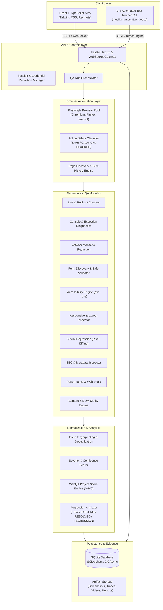

# WebQA Agent Architecture & System Design

## Overview
WebQA Agent is an enterprise-grade, general-purpose automated website quality-assurance platform. It inspects web applications, executes controlled browser workflows, discovers functional, visual, accessibility, and performance defects, collects comprehensive multimodal evidence, deduplicates findings, scores severity, and provides baseline-driven regression testing.

The system is designed with a **deterministic-first** approach: all inspection engines, rules, and scoring algorithms function autonomously without external AI services, while offering an optional LLM-assisted layer for exploratory planning and executive defect summarization.

---

## High-Level Architecture

---

## Core System Components

### 1. Browser Session & Pool Manager
- Manages isolated browser contexts per execution run.
- Configurable viewports, user agents, cookies, and HTTP authentication.
- Playwright-based execution supporting Chromium (default), Firefox, and WebKit.
- Built-in tracing, HAR recording, viewport & full-page screenshot pipelines.

### 2. Action Safety Classifier
Protects target environments against destructive mutations. Buttons, inputs, and forms are statically inspected before interaction:
- **BLOCKED**: Operations matching keywords such as `delete`, `purchase`, `pay`, `cancel`, `remove`, `order`, `transfer`, `publish`.
- **CAUTION**: Outbound mutations requiring explicit opt-in.
- **SAFE**: Non-destructive interactions (navigation, safe form fills, accordion expansions, search inputs).

### 3. Page Discovery & SPA Crawler
- Combines DOM anchor extraction, sitemap.xml ingestion, and client-side route listening (`pushState`, `replaceState`, `hashchange`).
- URL normalization: canonical path matching, fragment stripping, tracking param filtration (`utm_*`, `fbclid`).
- Configurable crawl depth (default: 4) and page limits (default: 100).

### 4. Deterministic QA Modules
- **Link Checker**: Verifies 200 OK, tracks redirect chains, classifies internal vs external, catches broken anchor/relative links.
- **Console Diagnostics**: Intercepts unhandled errors, React errors, hydration mismatches, CSP violations.
- **Network Monitor**: Intercepts 4xx/5xx responses, slow requests, failed resources; redacts `Authorization`, `Cookie`, API keys.
- **Form Discovery & Tester**: Analyzes inputs, generates safe boundary data, verifies required/min/max constraints.
- **Accessibility Scanner**: Locally bundled `axe-core` running WCAG 2.1 AA audits without remote CDNs.
- **Responsive & Overflow Tester**: Evaluates viewport clipping, horizontal scroll leaks, and element bounding-box collisions.
- **Visual Regression Engine**: Pixel-level comparison against baseline screenshots with configurable mismatch thresholds.
- **SEO & Metadata**: Validates Title, Meta Description, Canonical, Robots, OpenGraph, Viewport tags.
- **Performance Inspector**: Measures TTFB, DOMContentLoaded, Load Time, FCP, LCP, and CLS.

### 5. Issue Deduplication & Fingerprinting
Issues are identified by structural fingerprints combining:
- Normalized error signature
- Category & rule identifier
- Target selector or route pattern
- HTTP endpoint or stack trace signature
Recurring issues across 50 pages are consolidated into a single actionable issue record referencing all affected URLs.

### 6. Transparent QA Scoring Formula
The **WebQA Project Score** calculates a composite 100-point index:
$$\text{Score} = \max\left(0, 100 - (25 \times N_{\text{crit}} + 10 \times N_{\text{high}} + 4 \times N_{\text{med}} + 1 \times N_{\text{low}})\right)$$
Adjusted for accessibility compliance and visual regression deltas.
